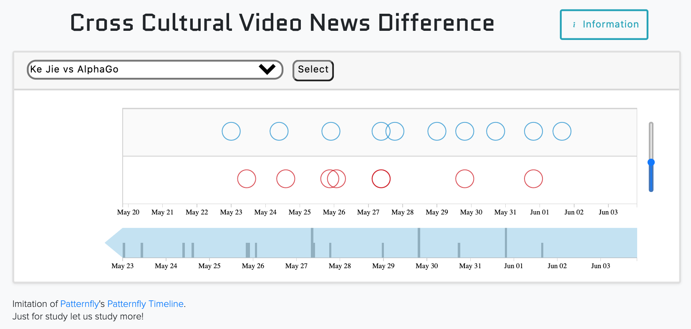
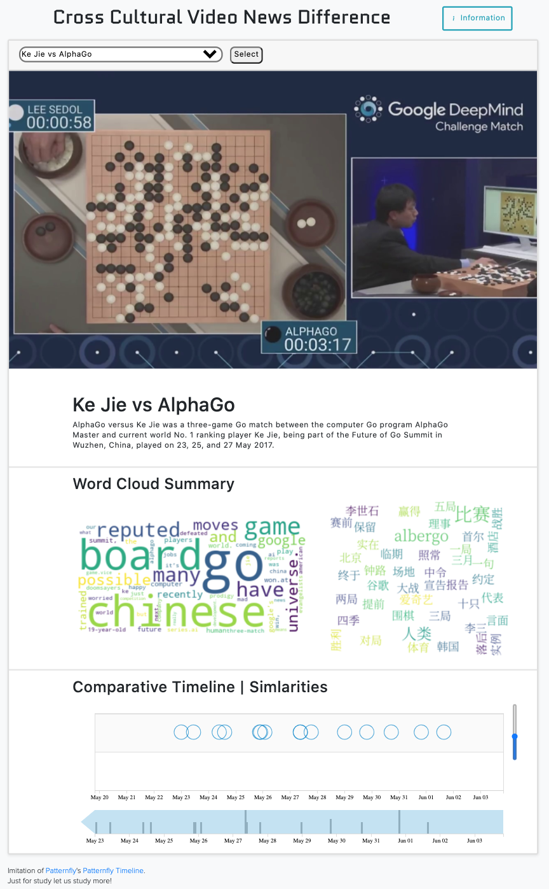

# Cross Cultural Multimedia Analysis

## Summary

This is an updated repository from the previous research by Prof John R. Kender team on the project
**"TAGGING AND BROWSING VIDEOS ACCORDING TO THE PREFERENCES OF DIFFERING AFFINITY GROUPS"**
at Columbia University

This repository includes an updated UI on word-clouds.

Previous repository:
https://github.com/luvenahuo/CrossCulturalMultimediaAnalysis

Here is the home page to this research project:
http://www.cs.columbia.edu/~jrk/NSFgrants/videoaffinity/

## Report

Here is a full report on the updated UI for spring of 2021:
[Wang,Shaun_FinalReport](miscellaneous/Wang_Shaun_Final_Report.pdf)

## Prototype Updates

|                               Old Prototype                                |                               New Prototype                                |
| :------------------------------------------------------------------------: | :------------------------------------------------------------------------: |
|  |  |

## Requirements:

- flask
- flask_sqlalchemy
- flask_migrate
- python-dotenv
- bootstrap
- multidict
- jieba
- word-cloud

**To run:**

- python3 -m pip install requirements.txt
- explort Flask_APP = app.py
- flask run
